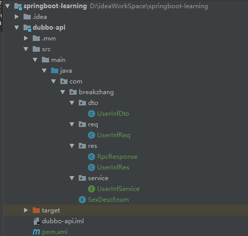
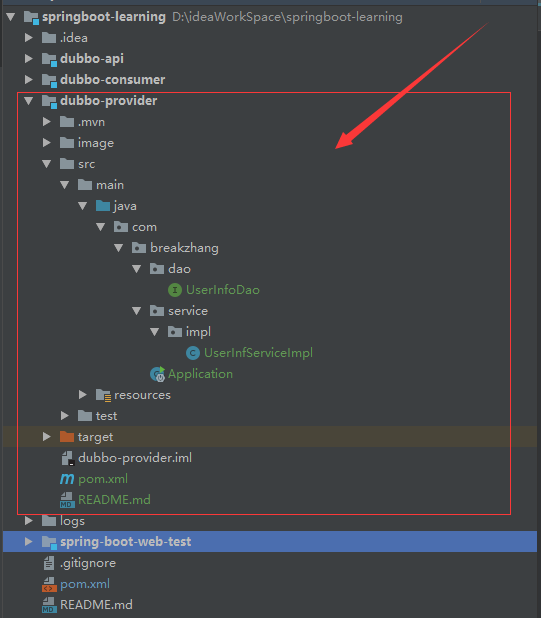
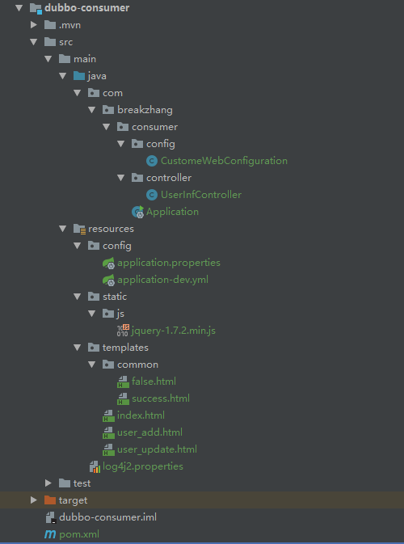

## spring boot 集成 dubbo

### 1. 创建 dubbo-api 模块
    


修改pom.xml 文件

```xml
<?xml version="1.0" encoding="UTF-8"?>
<project xmlns="http://maven.apache.org/POM/4.0.0" xmlns:xsi="http://www.w3.org/2001/XMLSchema-instance"
         xsi:schemaLocation="http://maven.apache.org/POM/4.0.0 https://maven.apache.org/xsd/maven-4.0.0.xsd">
    <modelVersion>4.0.0</modelVersion>
    <artifactId>dubbo-api</artifactId>
    <version>1.0.0</version>
    <packaging>jar</packaging>
    <name>dubbo-api</name>
    
    <!-- 主要引入lombok依赖 -->
    <dependencies>
        <dependency>
            <groupId>org.projectlombok</groupId>
            <artifactId>lombok</artifactId>
            <optional>true</optional>
        </dependency>
    </dependencies>
</project>
```

### 2. 创建 dubbo-provider 消费者模块



* 添加 dubbo 依赖

```xml
<!-- 引入dubbo-api依赖 -->
<dependency>
    <groupId>com.breakzhang</groupId>
    <artifactId>dubbo-api</artifactId>
    <version>1.0.0</version>
</dependency>

<!-- 引入zk依赖 -->
<dependency>
    <groupId>org.apache.dubbo</groupId>
    <artifactId>dubbo-dependencies-zookeeper</artifactId>
    <version>${dubbo.version}</version>
    <type>pom</type>
    <!-- 因为我使用的是log4j2 所以就排除了log4j的依赖 -->
    <exclusions>
        <exclusion>
            <groupId>org.slf4j</groupId>
            <artifactId>*</artifactId>
        </exclusion>
        <exclusion>
            <groupId>log4j</groupId>
            <artifactId>*</artifactId>
        </exclusion>
    </exclusions>
</dependency>

<!-- 引入dubbo依赖 -->
<dependency>
    <groupId>org.apache.dubbo</groupId>
    <artifactId>dubbo-spring-boot-starter</artifactId>
    <version>${dubbo.version}</version>
    <exclusions>
        <exclusion>
            <groupId>org.springframework</groupId>
            <artifactId>*</artifactId>
        </exclusion>
    </exclusions>
</dependency>
```

* 添加 dubbo 配置
```yaml
dubbo:
    registry:
        address: zookeeper://127.0.0.1:2181 # zk的连接地址
        timeout: 1000 # zk连接超时时间           
    protocol:
        port: 20562 # dubbo 端口
        name: dubbo
        threads: 100 # dubbo 的线程数，生产可以设置大一点
```

* 添加dubbo自动扫描
```java
@SpringBootApplication
@DubboComponentScan(basePackages = "com.breakzhang.service.impl") //自动扫描需要暴露的接口
@MapperScan("com.breakzhang.dao")
public class Application {

    public static void main(String[] args) {
        SpringApplication.run(Application.class, args);
    }

}
```

* 接口编写

```java
package com.breakzhang.service;
import com.breakzhang.req.UserInfReq;
import com.breakzhang.res.RpcResponse;
/**
 * @author: Created by zhangsf
 * @datetime: Created in 13:38 2020/12/17
 * @description: 用户服务接口
 */
public interface UserInfService {

    /**
     * 用户查询接口
     * @return
     */
    RpcResponse listUser();

}
```

```java
package com.breakzhang.service.impl;

import com.breakzhang.SexDescEnum;
import com.breakzhang.dao.UserInfoDao;
import com.breakzhang.dto.UserInfDto;
import com.breakzhang.req.UserInfReq;
import com.breakzhang.res.RpcResponse;
import com.breakzhang.res.UserInfRes;
import com.breakzhang.service.UserInfService;
import org.apache.dubbo.config.annotation.Service;
import javax.annotation.Resource;
import java.util.List;

/**
 * @author: Created by zhangsf
 * @datetime: Created in 14:17 2020/12/17
 * @description: @Service 注解要使用 org.apache.dubbo.config.annotation.Service
 */
@Service
public class UserInfServiceImpl implements UserInfService {

    @Resource
    private UserInfoDao userInfoDao;

    @Override
    public RpcResponse listUser() {
        List<UserInfDto> userInf = userInfoDao.listUserInf();
        userInf.forEach(user -> user.setSex(SexDescEnum.getDesc(user.getSex())));
        UserInfRes res = new UserInfRes();
        res.setList(userInf);
        return res;
    }
}

```
### 3. 创建 dubbo 消费者



* 添加 dubbo 依赖
```xml
<dependency>
    <groupId>com.breakzhang</groupId>
    <artifactId>dubbo-api</artifactId>
    <version>1.0.0</version>
</dependency>

<dependency>
    <groupId>org.apache.dubbo</groupId>
    <artifactId>dubbo-dependencies-zookeeper</artifactId>
    <version>${dubbo.version}</version>
    <type>pom</type>
    <exclusions>
        <exclusion>
            <groupId>org.slf4j</groupId>
            <artifactId>*</artifactId>
        </exclusion>
        <exclusion>
            <groupId>log4j</groupId>
            <artifactId>*</artifactId>
            </exclusion>
        </exclusions>
</dependency>

<dependency>
    <groupId>org.apache.dubbo</groupId>
    <artifactId>dubbo-spring-boot-starter</artifactId>
    <version>${dubbo.version}</version>
        <exclusions>
            <exclusion>
                <groupId>org.springframework</groupId>
                <artifactId>*</artifactId>
            </exclusion>
        </exclusions>
</dependency>
```

* 添加 dubbo 配置
```yaml
dubbo:
    application:
        name: dubbo
    registry:
        address: zookeeper://127.0.0.1:2181
        timeout: 1000
    consumer:
        check: false
```
* 调用 dubbo 接口
```java
@Controller
public class UserInfController {

    @Reference
    private UserInfService userInfService;

    /**
     * 首页
     * @param model
     * @return
     */
    @GetMapping("/")
    public String index(Model model) {
        UserInfRes res = null;
        RpcResponse response = userInfService.listUser();
        if (response.isSuccess()) {
            res = (UserInfRes) response;
        }
        model.addAttribute("alist", res != null ? res.getList() : "");
        return "index";
    }

    /**
     * 添加用户信息界面
     * @return
     */
    @GetMapping("/addUserHtml")
    public String addUserHtml() {
        return "user_add";
    }

    /**
     * 添加用户信息
     * @param req
     * @return
     */
    @RequestMapping("/addUser")
    @ResponseBody
    public boolean addUser(UserInfReq req){
        RpcResponse response = userInfService.saveUser(req);
        if (response.isSuccess()){
            return true;
        }else {
            return false;
        }
    }

    /**
     * 修改页面回显
     * @param userId
     * @param model
     * @return
     */
    @GetMapping("/goUpdateUser/{userId}")
    public String goUpdateUser(@PathVariable("userId") String userId, Model model) {

        UserInfReq req = new UserInfReq();
        req.setUserId(userId);
        UserInfDto userInf = null;
        RpcResponse response = userInfService.getUser(req);
        if (response.isSuccess()) {
            UserInfRes res = (UserInfRes) response;
            userInf = res.getData();
        }
        model.addAttribute("user", userInf);
        return "user_update";
    }

    /**
     * 修改用户信息
     * @param req
     * @return
     */
    @RequestMapping("/updateUser")
    @ResponseBody
    public boolean updateUser(UserInfReq req){
        RpcResponse response = userInfService.updateUser(req);
        if (response.isSuccess()){
            return true;
        }else {
            return false;
        }
    }

    /**
     * 删除用户信息
     * @param userId
     * @return
     */
    @GetMapping("/deleteUser/{userId}")
    public String deleteUser(@PathVariable("userId") String userId) {

        UserInfReq req = new UserInfReq();
        req.setUserId(userId);
        RpcResponse response = userInfService.deleteUser(req);
        if (response.isSuccess()){
            return "common/success";
        }else {
            return "common/false";
        }
    }
}    
```


